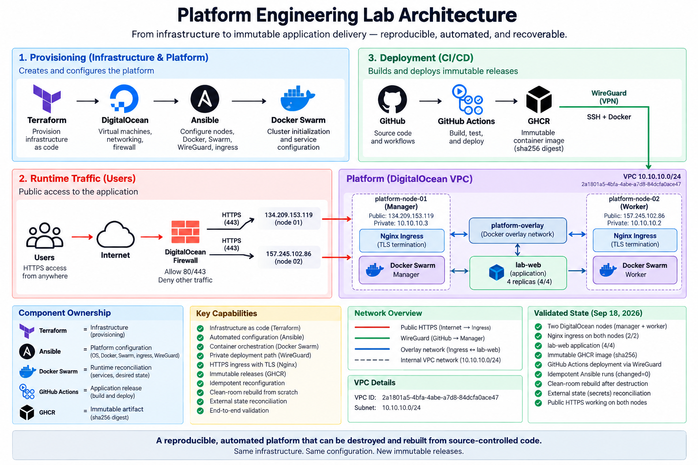

# Platform Engineering Lab

A hands-on platform engineering lab built to understand how infrastructure is **provisioned, configured, secured, deployed, broken, recovered, and reproduced**.

This project evolved from basic Docker networking and manual infrastructure into a reproducible two-node platform using:

- Terraform
- Ansible
- Docker
- Docker Swarm
- GitHub Actions
- GHCR
- WireGuard
- Nginx
- TLS
- DigitalOcean

The focus is not the number of tools.

The focus is understanding **state ownership, failure domains, deployment safety, infrastructure reproducibility, and operational recovery**.

---

## Current Status

The current platform has been implemented and validated through a complete clean-room rebuild.

```text
Infrastructure as Code             ✅
Two-node cloud infrastructure      ✅
Private VPC networking             ✅
Cloud firewall                     ✅
Linux configuration automation     ✅
SSH hardening                      ✅
Docker automation                  ✅
Multi-node Docker Swarm            ✅
Overlay networking                 ✅
Private application service        ✅
HTTPS ingress                      ✅
TLS lifecycle automation           ✅
Docker Configs / Secrets           ✅
WireGuard CI deployment network    ✅
GitHub Actions CI/CD               ✅
GHCR immutable releases            ✅
Rolling application deployment     ✅
Destroy → rebuild validation       ✅
External CI-state reconciliation   ✅
Operational idempotency            ✅
Release preservation               ✅
```

The complete platform was destroyed, reconstructed from the repository, connected back to GitHub Actions, and successfully received a new immutable application release.

---

# Architecture



```text
                            GitHub
                               │
                        push / workflow
                               │
                               ▼
                      GitHub Actions
                        │          │
                     Build       Deploy
                        │          │
                        ▼          ▼
                       GHCR    WireGuard
                        │          │
                        │      10.77.0.1
                        │          │
                        └────┬─────┘
                             ▼
                     platform-node-01
                      Swarm Manager
                       10.10.10.3
                             │
                     platform-overlay
                             │
                ┌────────────┴────────────┐
                │                         │
                ▼                         ▼
        platform-node-01          platform-node-02
        Swarm Manager             Swarm Worker
                │                         │
                └──────────┬──────────────┘
                           │
                       lab-web
                      4 replicas
                           ▲
                           │
                      lab-ingress
                      2 replicas
                           │
                     HTTP / HTTPS
                           │
                           ▼
                        Internet
```

The application itself is not directly exposed to the Internet.

Public traffic flows through the ingress layer:

```text
Internet
    ↓
DigitalOcean Firewall
    ↓
Swarm published ports
    ↓
lab-ingress
    ↓
platform-overlay
    ↓
lab-web
```

See [Platform Architecture](docs/architecture.md) for the complete architecture, control planes, trust boundaries, state domains and failure domains.

---

# State Ownership

One of the main design goals of the lab is to give each automation layer a clear responsibility.

```text
Terraform
    ↓
Cloud infrastructure

Ansible
    ↓
Host and platform configuration

Docker Swarm
    ↓
Runtime desired state

GitHub Actions
    ↓
Application delivery

GHCR
    ↓
Immutable application artifacts
```

In practical terms:

| Layer          | Responsibility                                        |
| -------------- | ----------------------------------------------------- |
| Terraform      | Droplets, firewall and cloud resource relationships   |
| Ansible        | Linux, SSH, Docker, WireGuard, Swarm, TLS and ingress |
| Docker Swarm   | Services, replicas, scheduling and reconciliation     |
| GitHub Actions | Application build and deployment                      |
| GHCR           | Immutable container artifacts                         |

Ansible can create an initial application service during a fresh rebuild, but once CI/CD deploys a release, subsequent configuration runs preserve that release.

---

# Infrastructure

The current environment consists of two Ubuntu 24.04 DigitalOcean nodes.

```text
DigitalOcean
│
├── Existing VPC
│   └── 10.10.10.0/24
│
├── platform-node-01
│   ├── Swarm Manager
│   └── 10.10.10.3
│
├── platform-node-02
│   ├── Swarm Worker
│   └── 10.10.10.2
│
└── Terraform-managed Cloud Firewall
```

Terraform creates:

```text
digitalocean_droplet.platform_node_01
digitalocean_droplet.platform_node_02
digitalocean_firewall.platform
```

The VPC and administrative cloud SSH key are intentionally treated as external prerequisites and resolved through Terraform data sources.

---

# Network Security

The cloud firewall separates public services from cluster-internal traffic.

```text
22/tcp
    administrative source only

80/tcp
    public HTTP ingress

443/tcp
    public HTTPS ingress

51820/udp
    WireGuard deployment tunnel

2377/tcp
7946/tcp
7946/udp
4789/udp
    private VPC only
```

Swarm management, gossip and overlay-network traffic are not exposed publicly.

---

# Configuration Management

Terraform creates the machines.

Ansible turns them into platform nodes.

```text
Terraform outputs
        ↓
generate-inventory.sh
        ↓
generated inventory.ini
        ↓
bootstrap-lab.sh
        ↓
Ansible
```

The generated inventory contains ephemeral cloud addresses and is intentionally gitignored.

The repository tracks the automation that creates the inventory rather than the current infrastructure addresses.

---

# Bootstrap

The main platform bootstrap entry point is:

```bash
./scripts/bootstrap-lab.sh
```

On fresh nodes it performs:

```text
Administrative SSH
        ↓
Linux baseline
        ↓
platform user
        ↓
sudo configuration
        ↓
SSH hardening
        ↓
Docker
        ↓
deployment SSH access
        ↓
WireGuard
        ↓
Swarm manager
        ↓
worker join
        ↓
overlay network
        ↓
application bootstrap
        ↓
TLS
        ↓
HTTPS ingress
        ↓
platform verification
```

The same entry point can safely run against an existing platform.

With unchanged state, the validated result is:

```text
changed=0
failed=0
unreachable=0
```

---

# Docker Swarm

Current cluster state:

```text
platform-node-01   Ready   Active   Leader
platform-node-02   Ready   Active
```

Current service target:

```text
lab-web       4/4
lab-ingress   2/2
```

`lab-web` is private and communicates through:

```text
platform-overlay
```

Swarm service discovery is used instead of depending on container IP addresses.

---

# HTTPS Ingress

`lab-ingress` runs two replicas and publishes:

```text
80/tcp
443/tcp
```

Expected behavior:

```text
HTTP
    ↓
301 redirect
    ↓
HTTPS
    ↓
Nginx
    ↓
lab-web:80
```

The current lab uses a self-signed certificate.

TLS configuration is automated by Ansible.

---

# Docker Configs and Secrets

Ingress configuration is represented using immutable Docker objects.

```text
nginx.conf
    ↓
Docker Config

tls.crt
    ↓
Docker Config

tls.key
    ↓
Docker Secret
```

Configuration and certificate versions use content-derived identities.

A configuration or certificate change creates a new immutable object instead of modifying an existing one in place.

---

# CI/CD

Application delivery is handled by:

```text
.github/workflows/lab-web-ci.yml
```

The pipeline performs:

```text
Git push
    ↓
application validation
    ↓
Docker Buildx
    ↓
container build
    ↓
GHCR
    ↓
capture image digest
    ↓
WireGuard
    ↓
deployment SSH
    ↓
Swarm manager
    ↓
docker service update
    ↓
rolling deployment
    ↓
rollout verification
```

---

# Immutable Releases

Application releases are identified using both the source commit and the OCI image digest.

```text
ghcr.io/alirasheedmd/platform-lab-web:
sha-<GIT_COMMIT>@sha256:<IMAGE_DIGEST>
```

The Git SHA provides:

```text
source traceability
```

The OCI digest provides:

```text
immutable artifact identity
```

The clean-room validation deployed:

```text
sha-e18431842fa466381601851d4deb4380a01f8685
```

using the immutable image digest produced by CI.

---

# Private CI Deployment Path

GitHub Actions does not use public SSH as its normal deployment path.

Instead:

```text
GitHub Actions
      │
      │ WireGuard
      ▼
Swarm Manager
   10.77.0.1
      │
      │ SSH
      ▼
platform user
      │
      ▼
Docker Swarm
```

A dedicated workflow validates this path independently:

```text
.github/workflows/platform-connectivity.yml
```

It verifies:

- WireGuard connectivity,
- VPN reachability,
- SSH authentication,
- Docker permissions,
- Swarm-manager access,
- GHCR authentication.

This separates connectivity failures from application build failures.

---

# GitHub State Reconciliation

Recreating a VM changes infrastructure identity.

For the manager, this includes:

```text
public IP address
SSH host key
```

GitHub therefore contains rebuild-sensitive state:

```text
PLATFORM_MANAGER_PUBLIC_IP
PLATFORM_SSH_KNOWN_HOST
```

These values are reconciled after a rebuild using:

```bash
./scripts/sync-github-secrets.sh
```

This is an important part of the rebuild process.

A platform rebuild is not complete merely because the new servers are running. External systems referencing the old infrastructure must also be reconciled.

---

# Clean-Room Rebuild

The platform has been tested using the following sequence:

```text
destroy compute
    ↓
terraform apply
    ↓
verify Terraform convergence
    ↓
bootstrap fresh nodes
    ↓
reconstruct Swarm
    ↓
reconstruct WireGuard
    ↓
reconstruct TLS / ingress
    ↓
synchronize GitHub state
    ↓
run CI connectivity validation
    ↓
validate public ingress
    ↓
push application release
    ↓
build immutable GHCR artifact
    ↓
deploy through WireGuard
    ↓
verify Swarm convergence
    ↓
verify public application
    ↓
rerun bootstrap
    ↓
prove idempotency
```

No manual server repair was required during the successful clean-room validation.

See [Clean-Room Rebuild Runbook](docs/runbooks/rebuild.md).

---

# Release Validation

A deployment is not considered successful only because GitHub Actions reports success.

The release is checked at three layers.

## 1. Desired State

```bash
sudo docker service ls
```

Expected:

```text
lab-web       4/4
lab-ingress   2/2
```

## 2. Artifact Identity

```bash
sudo docker service inspect lab-web \
  --format '{{.Spec.TaskTemplate.ContainerSpec.Image}}'
```

Expected form:

```text
ghcr.io/...:sha-<COMMIT>@sha256:<DIGEST>
```

## 3. User-Visible State

The application is fetched through both public ingress paths and checked for the newly deployed content.

```text
CI success
    +
Swarm convergence
    +
correct artifact digest
    +
public application response
    =
validated release
```

---

# Reproducibility

For this project, reproducibility does not simply mean:

> Terraform can create two servers.

It means:

```text
source-controlled infrastructure
        +
source-controlled configuration
        +
controlled external state
        +
explicit ownership boundaries
        +
repeatable reconciliation
        +
automated validation
        =
reproducible platform
```

The platform must be able to survive destruction of its disposable compute layer without relying on undocumented manual server configuration.

See [Lab Reproducibility](docs/reproducibility.md).

---

# Idempotency

After the immutable CI release was deployed, the complete bootstrap was run again.

The result was:

```text
platform-node-01   changed=0   failed=0   unreachable=0
platform-node-02   changed=0   failed=0   unreachable=0
```

The rerun also:

- did not reinitialize Swarm,
- did not unnecessarily rejoin the worker,
- did not recreate the overlay network,
- did not unnecessarily regenerate TLS,
- reused existing Docker Configs and Secrets,
- preserved the existing CI-owned application release.

This verifies operational idempotency separately from clean-room reproducibility.

---

# Repository Structure

Core platform paths:

```text
platform-lab/
│
├── .github/
│   └── workflows/
│       ├── lab-web-ci.yml
│       └── platform-connectivity.yml
│
├── applications/
│   └── lab-web/
│
├── configuration/
│   └── ansible/
│       ├── ansible.cfg
│       ├── inventory.ini        # generated, gitignored
│       ├── playbooks/
│       ├── roles/
│       ├── requirements.yml
│       └── vars/
│
├── infrastructure/
│   └── terraform/
│
├── docs/
│   ├── architecture.md
│   ├── reproducibility.md
│   ├── runbooks/
│   │   └── rebuild.md
│   └── validation/
│       └── 2026-09-17-ingress.md
│
├── scripts/
│   ├── bootstrap-lab.sh
│   ├── generate-inventory.sh
│   └── sync-github-secrets.sh
│
└── README.md
```

---

# Rebuilding the Platform

The detailed procedure is maintained in:

[docs/runbooks/rebuild.md](docs/runbooks/rebuild.md)

At a high level:

```bash
cd infrastructure/terraform

terraform plan
terraform apply
terraform plan

cd ../..

./scripts/bootstrap-lab.sh
./scripts/sync-github-secrets.sh

gh workflow run platform-connectivity.yml
```

After connectivity passes, application delivery is performed through the normal GitHub Actions release workflow.

Do not treat this abbreviated sequence as a substitute for the rebuild runbook when performing destructive operations.

---

# Documentation

Detailed documentation is intentionally separated from this README.

### Architecture

[docs/architecture.md](docs/architecture.md)

Covers:

- system topology,
- control planes,
- deployment path,
- trust boundaries,
- ownership boundaries,
- state domains,
- failure domains.

### Reproducibility

[docs/reproducibility.md](docs/reproducibility.md)

Covers:

- external state,
- clean-room reconstruction,
- idempotency,
- release ownership,
- dependency closure,
- acceptance criteria.

### Rebuild Runbook

[docs/runbooks/rebuild.md](docs/runbooks/rebuild.md)

Contains the operational rebuild procedure, validation gates and stop conditions.

### Validation Evidence

[docs/validation/](docs/validation/)

Contains dated validation evidence from platform exercises and reconstruction tests.

---

# Engineering Progression

The platform was intentionally built incrementally.

```text
Architecture and repository
        ↓
Terraform fundamentals
        ↓
Cloud networking
        ↓
Compute and firewall
        ↓
Ansible
        ↓
Linux access model
        ↓
SSH hardening
        ↓
Docker
        ↓
Docker networking
        ↓
Compose networking limitations
        ↓
Docker Swarm
        ↓
Multi-node orchestration
        ↓
Scheduling
        ↓
Failure recovery
        ↓
State and storage experiments
        ↓
Rolling updates
        ↓
Private registry
        ↓
CI/CD
        ↓
Ingress and TLS
        ↓
Private deployment networking
        ↓
Clean-room rebuild
        ↓
Operational idempotency
```

The tools were introduced because of a problem encountered in the previous stage rather than simply being added to the stack.

---

# Failure Engineering

The lab has intentionally exercised failure scenarios such as:

- killing service tasks,
- replica reconciliation,
- scaling services,
- draining and reactivating nodes,
- worker loss,
- service rescheduling,
- failed image deployment,
- rollback,
- node-local storage behavior,
- network isolation,
- destroyed and recreated infrastructure.

The goal is to understand not only how the happy path works, but also how the platform behaves when components fail.

---

# Current Boundaries

The current lab intentionally does **not** claim production completeness.

Known boundaries include:

- one Swarm manager, therefore no manager quorum HA,
- no managed external load balancer,
- self-signed TLS rather than publicly trusted certificates,
- no production secrets-management platform,
- no production-grade stateful disaster recovery,
- no automated backup/restore architecture,
- no multi-region architecture,
- no Kubernetes,
- incomplete observability stack.

These boundaries are documented rather than hidden.

---

# Next Platform Maturity Areas

Future work may include:

```text
Observability
├── Prometheus
├── Grafana
├── Node Exporter
└── cAdvisor

Stateful recovery
├── backup
├── restore
├── replication
├── RPO
└── RTO

Security
├── secrets-management platform
├── stronger deployment authorization
└── additional host/runtime hardening

Availability
├── manager quorum
└── external load balancing
```

These are future maturity areas, not requirements for the already-proven clean-room rebuild.

---

# Key Lessons

## Infrastructure is more than servers

Infrastructure also includes:

- identities,
- credentials,
- external references,
- networking,
- trust relationships,
- deployment systems.

---

## A successful command is not enough

A successful:

```text
terraform apply
```

does not prove that CI/CD works.

A successful:

```text
bootstrap-lab.sh
```

does not prove that GitHub references the correct manager.

A successful:

```text
GitHub Actions run
```

does not prove that users receive the correct release.

Each dependency layer needs its own evidence.

---

## State ownership matters

Terraform, Ansible and CI/CD must not continuously overwrite one another.

Clear ownership makes reconciliation predictable.

---

## Rebuilding is stronger evidence than installation

The strongest test of automation is not:

> Can this create infrastructure?

It is:

> Can the platform be destroyed and reconstructed without undocumented manual repair?

---

## Idempotency matters after the rebuild

A platform also needs to survive repeated reconciliation without unnecessary mutation.

The lab therefore validates both:

```text
clean-room reproducibility

and

operational idempotency
```

---

# Project Objective

This repository is a hands-on study of Platform Engineering fundamentals.

It is intended to demonstrate the transition from:

```text
manual infrastructure
        ↓
repeatable infrastructure
        ↓
automated configuration
        ↓
orchestrated workloads
        ↓
controlled deployments
        ↓
failure-aware operation
        ↓
reproducible platform
```

The goal is not to present the lab as a finished enterprise platform.

The goal is to demonstrate the engineering decisions, failure analysis, automation patterns and operational discipline required to build reliable platforms.
